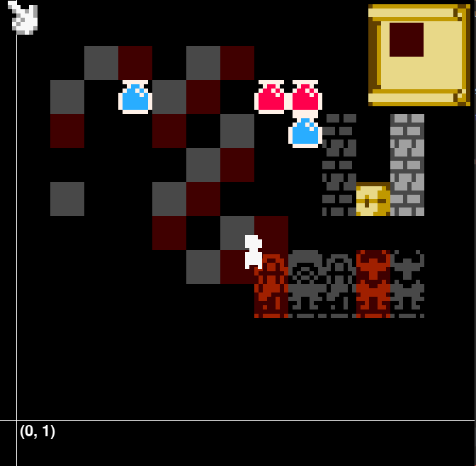

# The Linker Editor

This editor provides a streamlined way of creating maps! It currently support creating maps which are 126 x 126 tiles large, but I may extend this in the future.



## Controls

Move the player (and by extension the camera) with WASD.

Move the cursor to select tiles to place. If the filler tile is selected, it will automatically alternate which color tile is placed based on its relative location.

Click the map in the upper right corner to select the type of tile you want to place.

Scroll the mouse wheel to change the type of the currently-selected tile. For example, there are six different types of statues and four types of brick tiles.

Press `E` to save and `L` to load.

Press `P` to shift the palette between nes and pico-8.

Press `T` to delete the highlighted tile. Note that plinths can only be deleted from the left, and statues from the top!

## Chunks

Chunks are serialised to the following format upon save:

```json
[
	{
		"x": chunk_x,
		"y": chunk_y
		"tiles": [
			["Filler0", "Filler1", "Filler2", "Filler0", ...],
			[...],
			...
		],
		"collectibles":[
			{"name": name, "x": x, "y": y},
			{...},
			...
		]
	},
	{
		...
	},
	...
]
```

Instead of manually loading these into chunks, you can submit the loaded JSON to `Chunk.deserialise()` and it will take care of it. While Chunks have a `draw` function, it is recommended that you instead *use the chunks to instantiate stateful objects that have collision and collection logic*. For example, statues should be impassable and items should be collectible.

Stay tuned for the release of *Chromism*, an atmospheric palette shifting game made using the sprite library and map editor!

